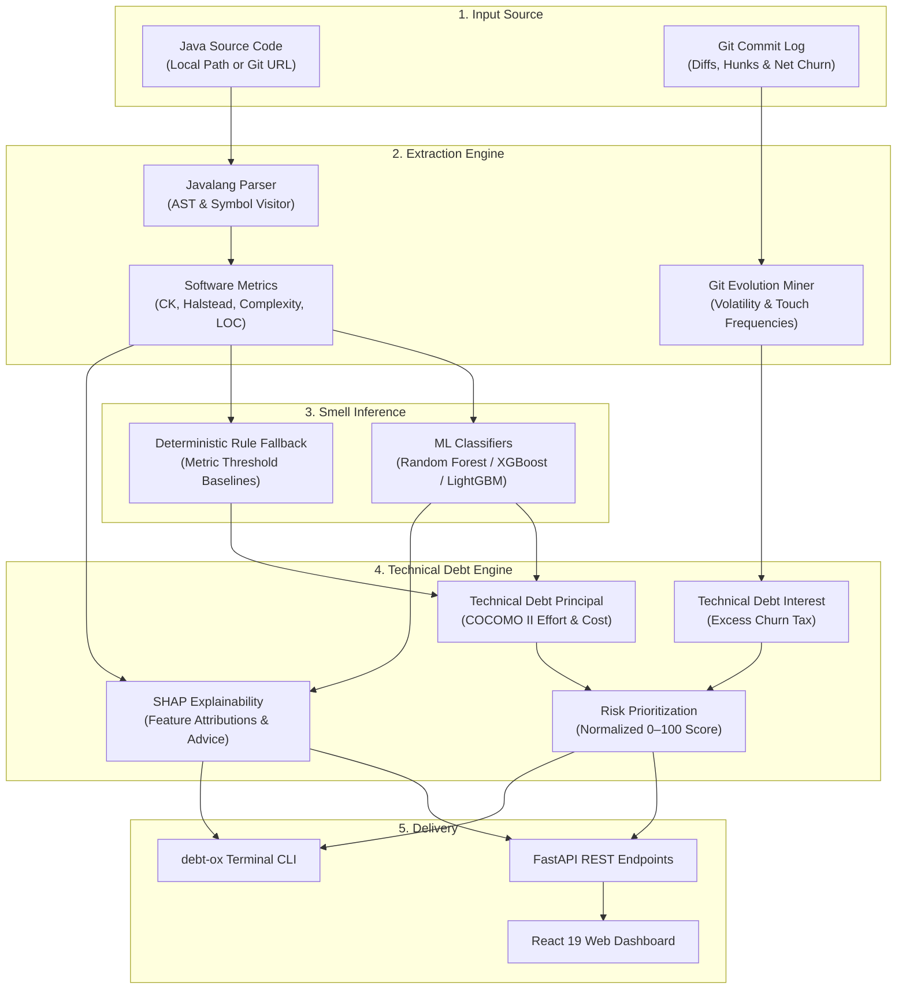

<div align="center">

# DebtOx

### Intelligent Code Smell Prediction & Technical Debt Quantification Platform

[](https://www.python.org/)
[](https://fastapi.tiangolo.com)
[](https://react.dev)
[](https://www.typescriptlang.org/)
[](https://vitejs.dev/)
[](https://tailwindcss.com/)
[](https://www.docker.com/)
[](LICENSE)

<p align="center">
  <b>DebtOx</b> is a production-grade software intelligence platform for Java repositories.<br/>
  It combines <b>Abstract Syntax Tree (AST) parsing</b>, <b>Git evolutionary history</b>, <b>machine learning-based code smell detection</b>, and <b>parametric financial modeling</b> to identify software debt and prioritize refactoring before technical debt compounds.
</p>

[Quick Start](#-quick-start) • [How It Works](#-how-it-works) • [Supported Smells](#-supported-code-smells) • [CLI](#-command-line-interface-cli) • [REST API](#-rest-api-reference) • [Docker](#3-docker-compose-production-ready)

</div>

---

## ⚡ The DebtOx Workflow

```text
┌─────────────────┐     ┌──────────────────┐     ┌─────────────────┐     ┌──────────────────┐     ┌─────────────────┐
│  Analyze Code   │ ──► │  Detect Smells   │ ──► │  Measure Debt   │ ──► │ Understand Risk  │ ──► │ Decide What Fix │
│                 │     │                  │     │                 │     │                  │     │                 │
│ Java AST + Git  │     │ ML Classifiers + │     │  TDP Effort (h) │     │ Composite Score  │     │ SHAP Insights & │
│ Churn & Metrics │     │ Heuristic Rules  │     │  TDI Churn Tax  │     │ 0 to 100 Scale   │     │ Guided Actions  │
└─────────────────┘     └──────────────────┘     └─────────────────┘     └──────────────────┘     └─────────────────┘
```

---

## ✨ Key Capabilities

| Capability | What It Does | Why It Matters |
| :--- | :--- | :--- |
| 🔍 **Zero-Build Static AST Analysis** | Parses Java 8–17 source files via `javalang` without requiring Maven, Gradle, or compilation. | Analyze any repository instantly, even if dependencies or JDK configurations are missing. |
| 📊 **Complete Metric Extraction** | Computes Chidamber & Kemerer (CK) metrics (WMC, CBO, RFC, LCOM5, DIT, NOC), Halstead volume/effort, and cyclomatic complexity. | Captures coupling, cohesion, inheritance depth, and cognitive complexity at class and method levels. |
| 🧬 **Git History & Churn Mining** | Mines commit logs for line additions, deletions, hunks, and net churn using `GitPython`. | Distinguishes dormant complex code from active, highly volatile hotspots that cause defects. |
| 🤖 **Dual-Layer Smell Detection** | Evaluates components using trained ML models (Random Forest, XGBoost, LightGBM) with deterministic rule fallbacks. | Combines empirical ML probability scores with guaranteed fallback reliability when model weights are not loaded. |
| ⏱️ **Parametric Debt Principal (TDP)** | Models remediation effort in engineering hours using COCOMO II maintenance effort equations and converts to USD cost. | Replaces arbitrary SonarQube flat-minute rules with size- and complexity-adjusted effort estimates. |
| 📈 **Longitudinal Debt Interest (TDI)** | Quantifies the ongoing maintenance penalty by comparing excess churn in smelly components against clean peers. | Demonstrates the compounding operational friction and developer time lost to code smells over time. |
| 🎯 **Actionable Risk Prioritization** | Scores every component on a normalized 0–100 scale balancing smell probability, severity, TDP, and churn. | Focus developer attention on the 5% of components generating 80% of maintenance risk. |
| 💡 **Explainable AI (TreeSHAP)** | Extracts metric-level feature contributions explaining *why* a component was classified as smelly. | Developers receive clear, plain-language refactoring advice rather than black-box score numbers. |

---

## 🔬 Supported Code Smells

DebtOx categorizes smell detections into **Class-Level** architectural smells and **Method-Level** procedural smells:

### Class-Level Smells

| Code Smell | Architectural Symptoms | Primary Metrics | Detection Strategy |
| :--- | :--- | :--- | :--- |
| **God Class** | Monolithic class centralizing too much system responsibility; low cohesion. | `WMC > 35`, `CBO > 12`, `SLOC > 250` | ML Classifier (RF / XGB) + Fallback |
| **Data Class** | Passive data holder containing fields and getters/setters with minimal behavior. | `WMC < 12`, `LCOM5 > 0.70`, `CBO < 6` | ML Classifier (RF / XGB) + Fallback |
| **Brain Class** | Overly complex class that accumulates complex algorithmic state and logic. | `WMC > 45`, `MNB >= 4`, `SLOC > 300` | Deterministic Heuristic Baseline |

### Method-Level Smells

| Code Smell | Architectural Symptoms | Primary Metrics | Detection Strategy |
| :--- | :--- | :--- | :--- |
| **Long Method** | Bloated method with excessive lines of code, deeply nested control flow, and multiple duties. | `SLOC > 50`, `Complexity > 10`, `MNB >= 3` | ML Classifier (LGB / RF) + Fallback |
| **Feature Envy** | Method that accesses data or calls methods of another class more than its own. | `ATFD > 5`, `FDP < 0.33`, `CBO > 5` | ML Classifier (LR / RF) + Fallback |
| **Brain Method** | Excessively complex method containing numerous conditionals and high cognitive load. | `Cyclomatic > 15`, `MNB >= 4`, `SLOC > 65` | Deterministic Heuristic Baseline |

---

## 🏗️ How It Works



---

## 🛠️ Tech Stack

<div align="center">

| Layer | Technologies |
| :--- | :--- |
| **Backend & REST API** | `Python 3.10+` `FastAPI 0.115+` `Uvicorn` `Pydantic v2` `pydantic-settings` |
| **AST & Git Mining** | `javalang 0.13` (Zero-compilation Java AST parser) `GitPython 3.1` |
| **ML & Explainability** | `scikit-learn 1.5+` `XGBoost 2.1+` `LightGBM 4.5+` `SHAP 0.45+` `pandas` `numpy` |
| **Frontend UI** | `React 19` `TypeScript 5.7` `Vite 6` `Tailwind CSS 3.4` `Lucide Icons` |
| **CLI & Output** | `Typer 0.12+` `Rich 13.7+` |
| **Testing & Infra** | `Pytest 8.0+` `HTTPX` `Docker` `Docker Compose` |

</div>

---

## 📁 Project Structure

```text
debtox/
├── analyzer/                 # Static analysis & repository mining
│   ├── extraction/           # Metrics extraction coordinator
│   ├── git/                  # Git commit, hunk & churn miner
│   ├── java/                 # Javalang AST traversal & lexical visitor
│   └── metrics/              # Structural (CK), complexity & Halstead calculators
├── backend/                  # FastAPI REST backend
│   ├── app/
│   │   ├── api/v1/           # API routes (/analyze, /analyses, /health, /debt)
│   │   ├── core/             # Pydantic configuration & environment settings
│   │   ├── debt/             # TDP (COCOMO II), TDI (churn tax) & risk engines
│   │   ├── explainability/   # TreeSHAP feature attributions & narratives
│   │   ├── ml/               # Smell inference engine & heuristic fallbacks
│   │   ├── schemas/          # Analysis request, response & metric schemas
│   │   └── services/         # Asynchronous analysis orchestration
│   └── tests/                # Comprehensive unit and integration test suite
├── cli/                      # Terminal interface commands (Typer + Rich)
├── frontend/                 # React 19 + TypeScript + Vite web dashboard
│   ├── src/
│   │   ├── components/       # UI elements (Navbar, ComponentModal, Cards)
│   │   ├── pages/            # Views (AnalyzePage, IssuesPage, ProjectsPage)
│   │   └── services/         # Axios/Fetch API client bindings
├── ml/                       # Machine learning pipelines, datasets & training
├── models/                   # Pre-trained model directory placeholder
├── storage/                  # Runtime analysis job store & report outputs
├── debt-ox                   # CLI executable launcher script
├── docker-compose.yml        # Multi-container orchestration (API + Web UI)
├── Dockerfile                # Multi-stage production container build
├── Makefile                  # Developer task automation (install, test, run)
└── requirements.txt          # Python backend dependencies
```

---

## 🚀 Quick Start

### Prerequisites
- **Python**: `3.10` or higher (`3.11` recommended)
- **Node.js**: `18.0` or higher with `npm`
- **Git**: Installed and accessible via PATH

---

### 1. Local Unified Run (Recommended)

Run both the FastAPI backend and built React web dashboard together on **port 8000**:

```bash
# 1. Clone repository
git clone https://github.com/debtox/debtox.git
cd debtox

# 2. Create and activate Python virtual environment
python3 -m venv .venv
source .venv/bin/activate

# 3. Install Python dependencies
pip install --upgrade pip
pip install -r requirements.txt

# 4. Build frontend production assets
cd frontend
npm install
npm run build
cd ..

# 5. Launch DebtOx (serves both Web UI and REST API)
python3 -m uvicorn backend.app.main:app --host 0.0.0.0 --port 8000
```

> [!TIP]
> Open **[http://localhost:8000](http://localhost:8000)** to view the web dashboard.
> Interactive Swagger API docs are available at **[http://localhost:8000/docs](http://localhost:8000/docs)**.

Or simply use the `Makefile`:
```bash
make install        # Install backend & frontend packages
make build-frontend # Build frontend bundle
make run            # Run unified server on :8000
```

---

### 2. Development Mode (Hot Reload)

For active code changes with automatic reloading:

```bash
# Terminal 1: Backend API (runs on http://localhost:8000 with auto-reload)
make run-api

# Terminal 2: Frontend Dev Server (runs on http://localhost:5173 with Vite HMR)
make run-ui
```

---

### 3. Docker Compose (Production Ready)

Run the containerized stack without installing local Python or Node dependencies:

```bash
# Build and run containers in background
docker compose up -d --build

# View container logs
docker compose logs -f

# Shut down
docker compose down
```

| Service | Port | Description |
| :--- | :--- | :--- |
| **Web Dashboard** | `http://localhost:3000` | Nginx-hosted React 19 Frontend |
| **REST API & Swagger** | `http://localhost:8000/docs` | FastAPI Application & ML Engine |

---

## 💻 Command Line Interface (CLI)

DebtOx includes an executable CLI (`./debt-ox`) built with `Typer` and `Rich`:

```bash
# Make CLI executable
chmod +x debt-ox

# Verify installation
./debt-ox version
```

### Common Commands

```bash
# 1. Analyze a local Java repository
./debt-ox analyze /path/to/java/project

# 2. Output formatted JSON (ideal for CI/CD pipelines)
./debt-ox analyze /path/to/java/project --format json

# 3. Quick mode (skips Git churn history for fast scans)
./debt-ox analyze /path/to/java/project --mode quick

# 4. View SHAP feature attributions and recommendations
./debt-ox explain <analysis_id> --top 5

# 5. Export analysis results to a standalone JSON report
./debt-ox report <analysis_id> --output debt_report.json
```

<details>
<summary><b>🔍 View Full CLI Command Reference</b></summary>

```text
Usage: ./debt-ox [COMMAND] [OPTIONS]

Commands:
  version                Display DebtOx system and API version.
  analyze <TARGET>       Analyze a Java project directory or Git URL.
    -b, --branch         Git branch to checkout.
    -m, --mode           Analysis mode: 'quick', 'full' (default), or 'research'.
    -c, --commits        Max Git commit history depth (default: 100).
    -f, --format         Output format: 'table' (default) or 'json'.
  explain <ANALYSIS_ID>  Print SHAP metric attributions for detected smells.
    -t, --top            Number of top-risk components to explain (default: 5).
  report <ANALYSIS_ID>   Export complete analysis payload to JSON.
    -o, --output         Output filename (defaults to report_<id>.json).
  train                  Run offline ML cross-validation and benchmark trainer.
```
</details>

---

## 🌐 REST API Reference

The FastAPI backend exposes RESTful endpoints at `/api/v1`:

```bash
# Check service health and loaded models
curl -s http://localhost:8000/api/v1/health | jq .
```

| Method | Endpoint | Description |
| :--- | :--- | :--- |
| `GET` | `/api/v1/health` | Service health status and loaded model count |
| `GET` | `/api/v1/version` | Version information |
| `POST` | `/api/v1/analyze` | Submit repository for asynchronous analysis (returns job ID) |
| `GET` | `/api/v1/analyses` | List recent analysis jobs |
| `GET` | `/api/v1/analyses/{id}` | Get complete analysis summary and component details |
| `GET` | `/api/v1/analyses/{id}/summary` | Get lightweight summary without component arrays |
| `GET` | `/api/v1/analyses/{id}/components` | Filter components by smell, granularity, or risk score |
| `GET` | `/api/v1/analyses/{id}/smells` | Aggregated smell counts across the repository |
| `GET` | `/api/v1/analyses/{id}/debt` | TDP effort, TDI hours, and estimated cost breakdown |
| `GET` | `/api/v1/analyses/{id}/explanations` | Component-level SHAP feature attributions |
| `GET` | `/api/v1/models` | List active model metadata and feature schemas |

<details>
<summary><b>📋 Example: Triggering Analysis via cURL</b></summary>

```bash
# Submit local repository analysis
curl -X POST http://localhost:8000/api/v1/analyze \
  -H "Content-Type: application/json" \
  -d '{
    "local_path": "/path/to/my-java-app",
    "mode": "full",
    "max_history_commits": 100
  }'

# Response:
# {
#   "analysis_id": "a58f4ae8-de23-485c-917a-64448ba129cb",
#   "repository_name": "my-java-app",
#   "status": "queued",
#   "progress_percentage": 0,
#   ...
# }
```
</details>

---

## ⚙️ Environment Variables

Configuration is loaded from environment variables or a root `.env` file. Copy the example configuration to customize parameters:

```bash
cp .env.example .env
```

<details>
<summary><b>⚙️ View All Configuration Options</b></summary>

| Variable | Default | Description |
| :--- | :--- | :--- |
| `PROJECT_NAME` | `DebtOx` | Display name of the application |
| `VERSION` | `1.0.0` | Application release version |
| `API_V1_PREFIX` | `/api/v1` | URL routing prefix for REST API |
| `DATABASE_URL` | `sqlite:///debtox.db` | Analysis database URI |
| `MAX_REPOSITORY_SIZE_MB` | `500` | Maximum allowed repository size |
| `MAX_FILES` | `10000` | Maximum total files scanned per job |
| `MAX_JAVA_FILES` | `5000` | Maximum `.java` files parsed per job |
| `MAX_ANALYSIS_TIME_SECONDS` | `600` | Maximum execution timeout (seconds) |
| `MAX_HISTORY_COMMITS` | `500` | Maximum Git commits mined for TDI churn |
| `COCOMO_A` | `2.94` | COCOMO II maintenance effort multiplier |
| `COCOMO_E` | `1.05` | COCOMO II maintenance scale exponent |
| `DEFAULT_DEVELOPER_HOURLY_RATE` | `65.0` | Blended developer rate ($/hr) for debt cost |
</details>

---

## 🧪 Testing

DebtOx includes a comprehensive test suite covering AST parsing, debt formulas, API routing, and end-to-end execution:

```bash
# Run tests with pytest
pytest backend/tests/ -v

# Or using Makefile
make test
```

```text
backend/tests/test_metrics.py         ✓ AST Parsing, CK & Halstead Metrics
backend/tests/test_debt_engines.py     ✓ COCOMO II TDP, TDI Churn & Risk Scoring
backend/tests/test_api_integration.py  ✓ FastAPI Routes, Health & Job Dispatching
backend/tests/test_e2e_pipeline.py     ✓ Full End-to-End Analysis Workflow
```

---

## ⚠️ Known Limitations

- **Language Scope**: Currently analyzes **Java** (`.java`) codebases only. Other languages are not parsed.
- **AST Parser**: Powered by `javalang` (Java 8 through 17 syntax). Certain preview or very recent syntax constructs are skipped gracefully to prevent analysis failure.
- **Git History Requirement**: Technical Debt Interest (TDI) calculations depend on commit history. When analyzing standalone folders without a `.git` database, TDI reports zero and analysis runs in snapshot mode.
- **Model Fallback**: If serialized model binaries (`models/*.joblib`) are not loaded, DebtOx automatically switches to deterministic metric threshold baselines, ensuring the platform remains fully functional.

---

## 📚 Research Context

DebtOx was developed as part of empirical software engineering research investigating machine learning techniques for code smell detection, parametric software maintenance modeling (COCOMO II), and longitudinal technical debt tracking.

---

## 📄 License

This project is licensed under the **MIT License** — see the [LICENSE](LICENSE) file for details.
