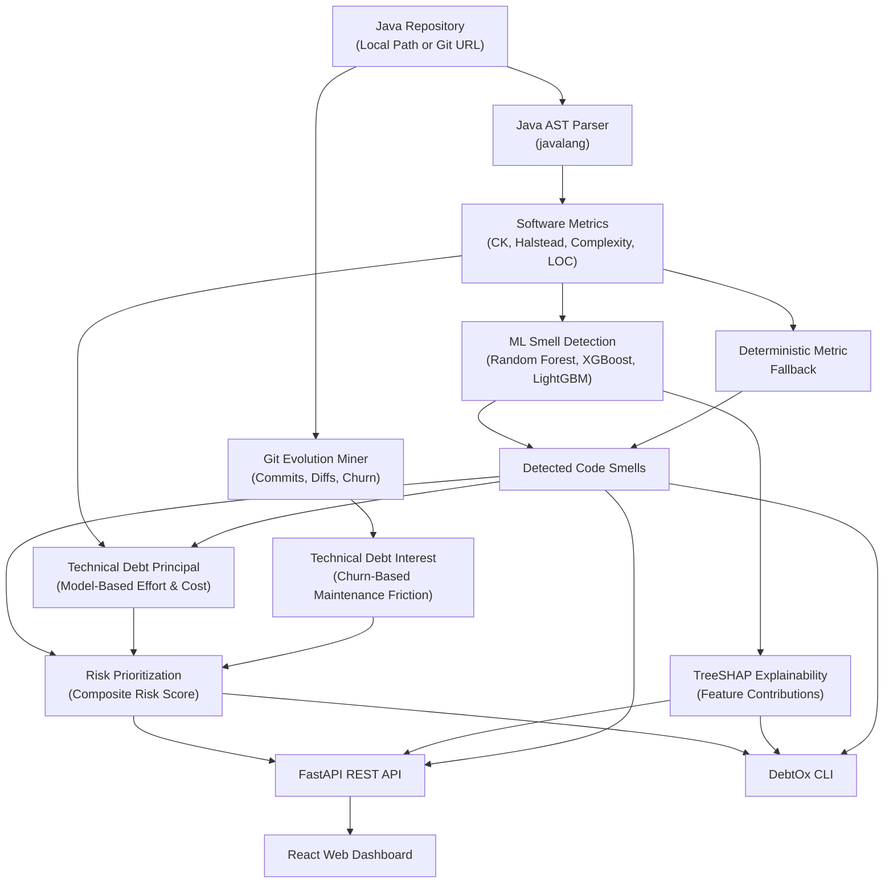

<div align="center">

# DebtOx

### Intelligent Code Smell Detection & Technical Debt Analysis for Java

DebtOx analyzes Java repositories, extracts software metrics, detects code smells with machine learning, measures technical debt, mines Git history, and explains model predictions.

<p>
  <a href="#-quick-start">Quick Start</a> ·
  <a href="#-how-it-works">How It Works</a> ·
  <a href="#-supported-code-smells">Supported Smells</a> ·
  <a href="#-cli">CLI</a> ·
  <a href="#-api">API</a>
</p>


</div>

---

## ✦ Overview

DebtOx is a software analysis platform built for Java codebases. It combines static source analysis, Git evolution data, machine learning, technical-debt estimation, and explainability in one workflow.

The goal is simple: help developers understand **where the code has problems, why those problems were detected, how much remediation effort may be involved, and which components deserve attention first**.

---

## ⚡ What DebtOx Does

```text
Java Repository
      │
      ├── Source Code ──► AST Parsing ──► Software Metrics
      │                                      │
      │                                      ▼
      │                              Code Smell Detection
      │                                      │
      └── Git History ──► Churn / Evolution ┘
                                             │
                                             ▼
                                  Technical Debt Analysis
                                      ├── TDP
                                      ├── TDI
                                      └── Risk Priority
                                             │
                                             ▼
                                  SHAP Explainability
                                             │
                           ┌─────────────────┴─────────────────┐
                           ▼                                   ▼
                     Web Dashboard                           CLI / API
```

### Core capabilities

| Capability | Description |
|---|---|
| 🔍 Static Analysis | Parses Java source and extracts structural, size, and complexity metrics without requiring project compilation. |
| 🧬 Git Evolution | Mines commits, additions, deletions, hunks, and churn for repository evolution analysis. |
| 🤖 Smell Detection | Uses trained ML models with deterministic metric-based fallbacks. |
| ⏱️ TDP | Estimates model-based remediation effort and cost using the DebtOx technical-debt model. |
| 📈 TDI | Uses historical churn to estimate recurring maintenance friction. |
| 🎯 Risk Prioritization | Produces a normalized risk score to help prioritize components for investigation. |
| 💡 Explainability | Uses TreeSHAP to show which features contributed to ML predictions. |
| 🌐 Multiple Interfaces | Provides a React web dashboard, FastAPI backend, and terminal CLI. |

---

## 🔬 Supported Code Smells

DebtOx currently focuses its empirical ML workflow on four smells:

| Code Smell | Level | Description |
|---|---|---|
| **God Class** | Class | A class that centralizes excessive responsibility and becomes difficult to maintain. |
| **Data Class** | Class | A class dominated by stored data and accessors with comparatively limited behavior. |
| **Long Method** | Method | A method whose size, control flow, or complexity makes it difficult to understand and maintain. |
| **Feature Envy** | Method | A method that depends heavily on data or behavior belonging to another class. |

> **Research scope:** Brain Class and Brain Method are not included in the verified empirical smell set because validated public ground-truth labels are unavailable in the benchmark data used by DebtOx.

---

## 🏗️ How It Works



---

## 🛠️ Tech Stack

| Layer | Technologies |
|---|---|
| Backend & API | Python, FastAPI, Uvicorn, Pydantic |
| Java Analysis | javalang, AST visitors |
| Git Mining | GitPython |
| Machine Learning | scikit-learn, XGBoost, LightGBM |
| Explainability | SHAP / TreeSHAP |
| Data & Statistics | Pandas, NumPy, SciPy |
| Frontend | React, TypeScript, Vite, Tailwind CSS, Lucide Icons |
| CLI | Typer, Rich |
| Testing | Pytest, HTTPX |
| Deployment | Docker, Docker Compose |

---

## 📁 Project Structure

```text
DebtOx/
├── analyzer/                 # Java AST analysis, metrics, and Git mining
├── backend/                  # FastAPI application and analysis services
│   ├── app/
│   └── tests/                # Backend test suite
├── cli/                      # Command-line interface
├── frontend/                 # React web dashboard
├── ml/                       # ML data, training, validation, and pipelines
├── models/                   # Runtime ML model artifacts
├── storage/                  # Local runtime analysis storage
├── scripts/                  # Reproducibility, analysis, and research scripts
├── data/                     # Local datasets and analysis repositories
├── experiments/              # Generated experiment results and figures
├── docs/                     # Project and research documentation
├── debt-ox                   # CLI launcher
├── Dockerfile                # Container build
├── docker-compose.yml        # Container orchestration
├── Makefile                  # Common developer commands
└── requirements.txt          # Python dependencies
```

---

## 🚀 Quick Start

### Prerequisites

- Python 3.10+
- Node.js 18+
- npm
- Git
- Docker and Docker Compose (optional)

### 1. Clone and install

```bash
git clone https://github.com/brijeshkumarmorya/debtox.git
cd debtox

python3 -m venv .venv
source .venv/bin/activate

pip install --upgrade pip
pip install -r requirements.txt
```

### 2. Build the frontend

```bash
cd frontend
npm install
npm run build
cd ..
```

### 3. Start DebtOx

```bash
python3 -m uvicorn backend.app.main:app --host 0.0.0.0 --port 8000
```

Open:

- Web dashboard: `http://localhost:8000`
- Swagger UI: `http://localhost:8000/docs`
- ReDoc: `http://localhost:8000/redoc`

### Makefile shortcuts

```bash
make install
make build-frontend
make run
```

### Development mode

```bash
make run-api
make run-ui
```

---

## 🐳 Docker

To run the containerized stack:

```bash
docker compose up -d --build
```

Useful commands:

```bash
docker compose logs -f
docker compose down
```

---

## 💻 CLI

DebtOx also provides a terminal interface through `./debt-ox`.

```bash
chmod +x debt-ox
./debt-ox version
```

### Common commands

```bash
# Analyze a Java repository
./debt-ox analyze /path/to/java/project

# JSON output
./debt-ox analyze /path/to/java/project --format json

# Quick analysis without Git history processing
./debt-ox analyze /path/to/java/project --mode quick

# Explain detected components
./debt-ox explain <analysis_id> --top 5

# Export an analysis report
./debt-ox report <analysis_id> --output debt_report.json
```

For all available commands:

```bash
./debt-ox --help
```

---

## 🌐 API

The backend exposes a REST API under `/api/v1`.

| Method | Endpoint | Purpose |
|---|---|---|
| `GET` | `/api/v1/health` | Service health and model status |
| `GET` | `/api/v1/version` | Application version information |
| `POST` | `/api/v1/analyze` | Start repository analysis |
| `GET` | `/api/v1/analyses` | List analyses |
| `GET` | `/api/v1/analyses/{id}` | Retrieve an analysis |
| `GET` | `/api/v1/analyses/{id}/summary` | Retrieve analysis summary |
| `GET` | `/api/v1/analyses/{id}/components` | Inspect analyzed components |
| `GET` | `/api/v1/analyses/{id}/smells` | Retrieve smell counts |
| `GET` | `/api/v1/analyses/{id}/debt` | Retrieve debt estimates |
| `GET` | `/api/v1/analyses/{id}/explanations` | Retrieve SHAP explanations |
| `GET` | `/api/v1/models` | Retrieve loaded model metadata |

Interactive documentation is available at `/docs` and `/redoc` when the backend is running.

---

## ⚙️ Configuration

DebtOx reads configuration from environment variables and/or a root `.env` file.

For local configuration:

```bash
cp .env.example .env
```

Do not commit real secrets or credentials.

Common settings include repository size/file limits, Git history depth, API configuration, and technical-debt model parameters. Check `.env.example` for the current project configuration.

---

## 🧪 Testing

Run the backend test suite with:

```bash
pytest backend/tests/ -v
```

Or:

```bash
make test
```

The tests cover areas including metric extraction, debt engines, API behavior, and end-to-end analysis.

---

## ⚠️ Known Limitations

- **Java only:** DebtOx currently analyzes Java source code.
- **Parser scope:** The analyzer relies on `javalang`; some newer Java syntax may not be fully supported.
- **Git-dependent analysis:** TDI requires Git history. Plain source folders can still be analyzed, but longitudinal churn information is unavailable.
- **Model availability:** When trained model artifacts are unavailable, DebtOx can fall back to deterministic metric-based rules where supported.
- **Technical debt estimates:** TDP is a model-based engineering effort estimate, not stopwatch-measured developer time.

---

## 📚 Research Context

DebtOx is also used as the implementation platform for empirical research on machine-learning-based code smell detection, software maintenance effort modeling, and longitudinal technical debt analysis.

Research artifacts and experiment outputs are maintained separately from the core application workflow.

---

## 📄 License

This project is licensed under the **MIT License**. See [`LICENSE`](LICENSE) for details.