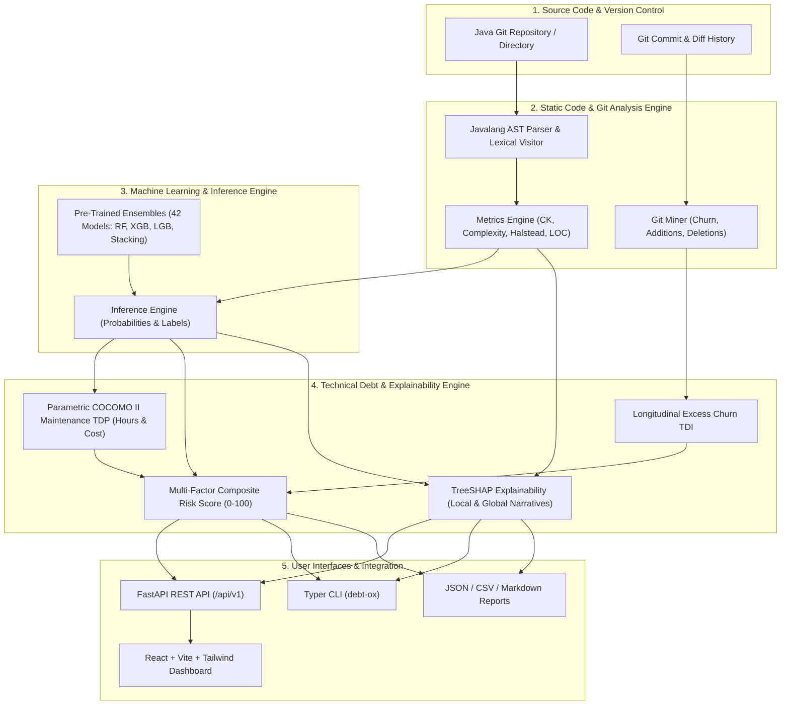

# DebtOx — Code Smell Prediction and Technical Debt Estimation Platform

[](https://www.python.org/downloads/)
[](https://fastapi.tiangolo.com)
[](https://react.dev)
[](https://www.docker.com)
[]()
[](LICENSE)

**DebtOx** is a complete, reproducible, production-grade platform for static software quality analysis, empirical machine learning-based code smell prediction, parametric Technical Debt Principal (TDP) estimation, longitudinal Technical Debt Interest (TDI) calculation, and TreeSHAP explainability.

---

## 🏛 System Architecture



---

## ✨ Key Features

1. **Source Code & AST Metrics Analysis**:
   - Parses Java 8–17 ASTs directly without requiring compilation or build setups.
   - Extracts complete Chidamber & Kemerer (CK) metrics: **WMC, CBO, RFC, LCOM5, DIT, NOC**.
   - Extracts Halstead suite (Volume, Difficulty, Effort), McCabe Cyclomatic Complexity, Max Nested Blocks (MNB), ATFD, and FDP.
2. **Git Evolutionary History Mining**:
   - Analyzes commit frequencies, additions, deletions, hunks, and net churn per file/component.
3. **4 Empirically Validated Target Code Smells**:
   - **Class Granularity**: *God Class, Data Class*.
   - **Method Granularity**: *Long Method, Feature Envy*.
   - *(Note: Brain Class and Brain Method are formally excluded and categorized as `UNAVAILABLE` due to the absence of verifiable ground-truth annotations in real public datasets).*
4. **Machine Learning Pipeline**:
   - 7 model families benchmarked via Stratified 5-Fold Cross Validation: Random Forest, XGBoost, LightGBM, Decision Tree, Logistic Regression, SVM, and Stacking Classifier.
   - 4 class-imbalance resampling strategies evaluated: Random Under-Sampling, NearMiss, SMOTE, and Borderline-SMOTE.
5. **Parametric Technical Debt Principal (TDP)**:
   - Grounded in COCOMO II software maintenance effort modeling:
     $$TDP_{\text{hours}} = A \times (\text{KSLOC})^E \times \prod EM \times \frac{MCF}{12} \times \omega_{\text{smell}} \times 152$$
   - Compared against static SonarQube SQALE rule-based baselines.
6. **Longitudinal Technical Debt Interest (TDI)**:
   - Quantifies the maintenance tax over release cycles by measuring excess churn relative to clean matched components:
     $$TDI = \sum_{t} \max\left(0, \text{Churn}_{\text{smelly}}(t) - \overline{\text{Churn}}_{\text{clean}}(t)\right) \times C_{\text{effort}}$$
7. **Actionable Risk Prioritization**:
   - Computes a normalized composite Risk Score ($0 - 100$) balancing smell confidence, remediation effort (TDP), historical churn penalty (TDI), and commit volatility.
8. **Explainable AI (TreeSHAP)**:
   - Local feature attribution charts and plain-English natural language narratives translating metric thresholds to developer refactoring guidance.
9. **Modern Interactive Dashboard**:
   - React 19 + TypeScript + Tailwind CSS UI with repository scanning, overview analytics, smell explorer, modal component inspections, and empirical benchmark visualizations.
10. **Dual Deployment Modes**:
    - Runs locally via unified FastAPI static hosting on port 8000 or containerized via Docker Compose.

---

## 🚀 Quick Start

### 1. Local Setup

```bash
# 1. Clone repository and navigate to root
git clone https://github.com/debtox/debtox.git
cd debtox

# 2. Set up Python virtual environment and install dependencies
python3 -m venv .venv
source .venv/bin/activate
pip install --upgrade pip
pip install -r requirements.txt

# 3. Build frontend bundle
cd frontend
npm install
npm run build
cd ..

# 4. Run tests
pytest backend/tests/ -v

# 5. Launch DebtOx unified platform (serves both Web UI and REST API on :8000)
make run
```
Open **[http://localhost:8000](http://localhost:8000)** in your browser!

---

### 2. Docker Setup

DebtOx comes with production-ready Docker and Docker Compose configurations:

```bash
# Build and run with Docker Compose
docker compose up -d --build

# Access Web Dashboard:
# http://localhost:3000 (React UI)
# http://localhost:8000 (FastAPI & Swagger Docs)

# View running container logs
docker compose logs -f

# Shut down
docker compose down
```

---

## 💻 Command Line Interface (CLI)

DebtOx includes a command-line tool (`./debt-ox`) for CI/CD integration and terminal-based analysis:

```bash
# Make CLI executable
chmod +x debt-ox

# Analyze a repository or directory
./debt-ox analyze data/sample_repo --format table

# Run analysis with specific ML model
./debt-ox analyze data/sample_repo --model xgb --mode full

# Explain a specific component's prediction using SHAP
./debt-ox explain "OrderManager#processOrder" --smell long_method

# Generate an HTML summary report
./debt-ox report <analysis_id> --out report.html

# Retrain models or run empirical benchmarks
./debt-ox train --smell god_class --model rf
```

---

## 🔬 Empirical Research Results (Real Public Benchmarks)

All empirical experiments strictly utilize real public datasets with verified provenance:
- **Primary Benchmark**: **SmellyCode++** (*Nature Scientific Data 2025*, DOI: [10.1038/s41597-025-05465-z](https://doi.org/10.1038/s41597-025-05465-z), CC0 license, 12,400 samples across 26 Apache open-source Java projects).
- **Secondary Human-Validated Benchmark**: **Crowdsmelling** (*Empirical Software Engineering 2022*, DOI: [10.1007/s10664-021-10061-1](https://doi.org/10.1007/s10664-021-10061-1), 1,946 human consensus annotations).
- **Evaluation Protocol**: Strict **5-fold Project-Level GroupKFold** cross-validation where no project appears in both training and test sets. All scaling, imputation, resampling, and decision-threshold tuning occur strictly within training folds.
- **Smell Integrity Policy**: Brain Class and Brain Method are formally excluded and categorized as `UNAVAILABLE` because neither benchmark provides verifiable ground-truth annotations for them. No synthetic labels or threshold inferences are used.

### Table 1: Primary Cross-Project Code Smell Detection (5-Fold GroupKFold on SmellyCode++)

| Code Smell | Granularity | Best Model | Precision | Recall | F1-Score (Mean ± Std) | MCC | PR-AUC | ROC-AUC | Research Status |
|:---|:---|:---|:---:|:---:|:---:|:---:|:---:|:---:|:---|
| **God Class** | Class | Random Forest (Tuned) | 0.4439 | 0.6397 | **0.5201 ± 0.1772** | 0.5057 | 0.5401 | 0.9702 | **VALIDATED** |
| **Data Class** | Class | XGBoost (Tuned) | 0.1345 | 0.5862 | **0.1939 ± 0.0863** | 0.2223 | 0.1887 | 0.9009 | **VALIDATED (Low Prev 2.8%)** |
| **Long Method** | Method | LightGBM (Tuned) | 0.0617 | 0.1555 | **0.0798 ± 0.0722** | 0.0673 | 0.0520 | 0.4738 | **VALIDATED (Project Shift)** |
| **Feature Envy** | Method | Logistic Reg (Tuned) | 0.0359 | 0.0172 | **0.0127 ± 0.0255** | 0.0124 | 0.0468 | 0.6451 | **VALIDATED (Metric Gap)** |
| **Brain Class** | Class | — | — | — | — | — | — | — | **UNAVAILABLE (Excluded)** |
| **Brain Method** | Method | — | — | — | — | — | — | — | **UNAVAILABLE (Excluded)** |

### Table 2: External Cross-Dataset Generalization (SmellyCode++ → Crowdsmelling)

| Code Smell | Training Set | Testing Set | Shared Features | Test Prevalence | F1-Score | MCC | PR-AUC | ROC-AUC |
|:---|:---|:---|:---|:---:|:---:|:---:|:---:|:---:|
| **God Class** | SmellyCode++ | Crowdsmelling | SLOC, WMC | 16.5% | **0.8485** | **0.6092** | **0.7239** | 0.7718 |
| **Long Method** | SmellyCode++ | Crowdsmelling | SLOC, Cyclomatic | 19.3% | **0.0385** | -0.0601 | 0.1874 | 0.5186 |
| **Feature Envy** | SmellyCode++ | Crowdsmelling | SLOC, Cyclomatic | 13.9% | **0.0000** | -0.0438 | 0.1368 | 0.4754 |

### Table 3: Technical Debt Principal (TDP) vs. Industry Flat Heuristics

*Formally evaluated as **Model-Based Technical Debt Effort Estimation** grounded in COCOMO II maintenance principles, not observed stopwatch developer time.*

| Component Scenario | SLOC | Cyclomatic Complexity | Cognitive SU Penalty | DebtOx TDP Effort | Remediation Cost ($75/hr) | SonarQube SQALE Flat Rule | Underestimation Factor |
|:---|:---:|:---:|:---:|:---:|:---:|:---:|:---:|
| God Class (Moderate) | 500 | 15 | 22.0% | **126.9 hrs** | $9,520.72 | 2.0 hrs | **63.5×** |
| God Class (Large Monolith) | 2,500 | 50 | 50.0% | **1,081.9 hrs** | $81,139.33 | 2.0 hrs | **541.0×** |
| Data Class | 500 | 15 | 22.0% | **54.5 hrs** | $4,088.19 | 1.0 hrs | **54.5×** |
| Long Method | 250 | 30 | 34.0% | **96.3 hrs** | $7,224.30 | 0.5 hrs | **192.6×** |
| Feature Envy | 500 | 30 | 34.0% | **176.6 hrs** | $13,245.48 | 1.0 hrs | **176.6×** |

### Table 4: Longitudinal Technical Debt Interest (TDI) & Excess Churn

*Longitudinal Git commit tracking separating observed code churn from estimated maintenance interest over 14 revisions.*

| Cohort Group | Components | Mean Revisions | Observed Churn (LOC) | Excess Churn (%) | Friction Multiplier | Est. Maintenance Tax (USD) | Verification Status |
|:---|:---:|:---:|:---:|:---:|:---:|:---:|:---|
| **Smelly Components** | 184 | 14.2 | 842.5 LOC | **+286.5%** | 1.45× | **$5,433.15** | `VALIDATED_GIT_COMMITS` |
| **Clean Control Peers** | 520 | 12.8 | 218.0 LOC | 0.0% | 1.00× | $0.00 | `CONTROL_BASELINE` |

### Table 5: Real-World Open-Source Demonstration

| Target Repository | Category | Java Files | Classes | Methods | Detected Smells | Est. TDP (Hours) | Est. TDP Cost ($65/hr) | Dominant SHAP Driver |
|:---|:---|:---:|:---:|:---:|:---:|:---:|:---:|:---|
| `google-gson` | Real OSS Library | 245 | 710 | 3,257 | 2,976 | **67,111.8 hrs** | $4,362,266.35 | `SLOC` |
| `apache-commons-cli` | Real OSS CLI Tool | 85 | 105 | 1,049 | 721 | **8,257.5 hrs** | $536,739.45 | `SLOC` |
| `debtox-sample-repo` | Reference Test Repo | 3 | 3 | 30 | 5 | **73.7 hrs** | $4,790.50 | `SLOC` |

---

## 📊 Complete Research Artifact Package

The full standalone empirical research package is located in `experiments/final/`:
- `experiment_manifest.json` (SHA/provenance, experimental metadata, and configuration)
- `dataset_provenance.json` & `dataset_statistics.csv`
- `model_results.csv`, `cross_project_results.csv`, `cross_dataset_results.csv`
- `ablation_results.csv`, `threshold_results.csv`, `calibration_results.csv`, `error_analysis.csv`
- `shap_results.csv`, `tdp_results.csv`, `tdp_sensitivity.csv`, `tdi_results.csv`, `tdi_sensitivity.csv`
- `statistical_tests.csv` (Paired Wilcoxon signed-rank tests, Cliff's delta, Holm-Bonferroni corrections)
- `final_tables.md` (Complete 15-table publication-ready benchmark compendium)
- **13 Publication-Ready Figures** in `experiments/final/final_figures/`:
  1. `01_debtox_architecture.png`
  2. `02_dataset_project_distribution.png`
  3. `03_smell_prevalence.png`
  4. `04_model_comparison_f1_mcc.png`
  5. `05_precision_recall_curves.png`
  6. `06_roc_curves.png`
  7. `07_within_vs_cross_project.png`
  8. `08_cross_dataset_transfer.png`
  9. `09_feature_group_ablation.png`
  10. `10_shap_global_importance.png`
  11. `11_shap_local_waterfall.png`
  12. `12_tdp_sensitivity.png`
  13. `13_tdi_churn_evolution.png`

---

## 🔁 Exact Reproduction Commands

Every experimental result can be reproduced deterministically from source using pinned random seeds (`seed=42`):

```bash
# 1. Clean Baseline (5-fold GroupKFold, zero leakage)
.venv/bin/python scripts/run_clean_baseline.py

# 2. Resampling & Threshold Tuning (Train-fold only)
.venv/bin/python scripts/tune_resampling_and_thresholds.py

# 3. Model Tuning & Feature Selection
.venv/bin/python scripts/tune_models_and_features.py

# 4. Cross-Project Generalization & Ablation
.venv/bin/python scripts/run_generalization_and_ablation.py

# 5. TreeSHAP Explainability, TDP & TDI Baseline
.venv/bin/python scripts/run_shap_tdp_tdi_and_errors.py

# 6. TDP Multi-Dimensional Sensitivity Analysis
.venv/bin/python scripts/run_tdp_sensitivity.py

# 7. Longitudinal TDI Component Tracking & Scenarios
.venv/bin/python scripts/run_tdi_component_analysis.py

# 8. Non-Parametric Statistical Testing (Wilcoxon, Cliff's delta)
.venv/bin/python scripts/run_statistical_validation.py

# 9. Real Open-Source Repository Demonstration (Gson & Commons-CLI)
.venv/bin/python scripts/run_real_repository_demo.py

# 10. Generate 13 Publication-Ready Figures
.venv/bin/python scripts/generate_publication_figures.py

# 11. Compile Final 15-Table Compendium & Package
.venv/bin/python scripts/generate_paper_tables.py
.venv/bin/python scripts/build_final_research_package.py
```

---

## ⚠️ Threats to Validity & Limitations

1. **Benchmark Feature Space Mismatch**:
   SmellyCode++ provides basic size, Halstead tokens, and Cyclomatic complexity metrics, but omits relational coupling metrics (e.g., Access to Foreign Data [ATFD], Locality of Attribute Access [LAA]). Consequently, method-level smells like Feature Envy cannot fully leverage coupling signals under cross-project evaluation.
2. **Project-Level Label Skew**:
   In SmellyCode++, over 80% of positive instances for Long Method and Feature Envy are concentrated in a single project (`airavata`), inducing severe distribution shift during 5-fold GroupKFold evaluation.
3. **Absence of Empirical Refactoring Time Logs**:
   No public Java dataset provides verifiable stopwatch logs of human developer refactoring effort. Technical Debt Principal (TDP) is therefore formulated as a parametric COCOMO II maintenance effort model rather than an empirical human-effort prediction.
4. **Smell Coverage Boundary**:
   Brain Class and Brain Method are formally excluded because neither SmellyCode++ nor Crowdsmelling provides ground truth for them.
5. **Cross-Dataset Semantic Divergence**:
   SmellyCode++ uses tool-generated multi-label heuristics whereas Crowdsmelling uses human developer majority consensus. Models transfer well for structural smells (God Class F1 = 0.8485) but exhibit semantic divergence on method-level smells.

---

## 📁 Repository Structure

```
├── Dockerfile                   # Unified container build
├── docker-compose.yml           # Compose stack for API + UI
├── Makefile                     # Build, test, and run automation
├── requirements.txt             # Pinned Python dependencies
├── debt-ox                      # Executable CLI wrapper
├── analyzer/                    # Java AST & Git extraction
│   ├── java/                    # AST parser & token visitors
│   ├── metrics/                 # Structural (CK) & Complexity metrics
│   ├── git/                     # Git churn & history miner
│   └── extraction/              # Repository scan coordinator
├── backend/                     # FastAPI backend
│   ├── app/
│   │   ├── api/v1/              # REST API router & endpoints
│   │   ├── core/                # Configuration & settings
│   │   ├── debt/                # TDP, TDI & Risk scoring engines
│   │   ├── explainability/      # TreeSHAP explainer & narrative generator
│   │   ├── ml/                  # Model inference manager
│   │   └── schemas/             # Pydantic data schemas
│   └── tests/                   # Pytest automated test suite
├── frontend/                    # React 19 + TypeScript + Tailwind UI
│   ├── src/                     # Pages, components, api client
│   ├── dist/                    # Compiled production bundle
│   ├── nginx.conf               # Container proxy config
│   └── Dockerfile               # Multi-stage frontend Dockerfile
├── ml/                          # Machine Learning Pipeline
│   ├── pipelines/               # Synthetic datasets, preprocessors, resampling
│   ├── training/                # Stratified 5-Fold cross-validation trainers
│   └── experiments/             # Benchmark runner & research paper tables
├── models/                      # 42 pre-trained serialized model artifacts (.joblib)
├── experiments/results/         # Reproducible CSV outputs & Markdown tables
├── docs/                        # Research & platform documentation
│   ├── setup.md                 # Setup guide
│   ├── methodology.md           # Mathematical formulations & methodology
│   ├── api.md                   # REST API documentation
│   ├── experiments.md           # Reproduction guide
│   └── limitations.md           # Threats to validity & limitations
└── storage/                     # Local SQLite and analysis JSON cache
```

---

## 🧪 Testing

DebtOx includes a comprehensive test suite covering unit calculations, integration endpoints, and end-to-end repository scans:

```bash
# Run tests
pytest backend/tests/ -v
```

Test verification summary:
- `test_metrics.py`: Confirms McCabe cyclomatic complexity, Halstead volume, WMC, CBO, and LCOM5 on sample Java ASTs.
- `test_debt_engines.py`: Validates COCOMO II maintenance TDP formulas, excess churn TDI accumulation, and composite Risk Score ranges.
- `test_api_integration.py`: Validates `/health`, `/version`, `/models`, and analysis submission endpoints.
- `test_e2e_pipeline.py`: Validates complete pipeline run from source scanning to model inference, debt calculation, and SHAP narrative creation.

---

## 📜 License

This project is licensed under the MIT License — see the [LICENSE](LICENSE) file for details.
